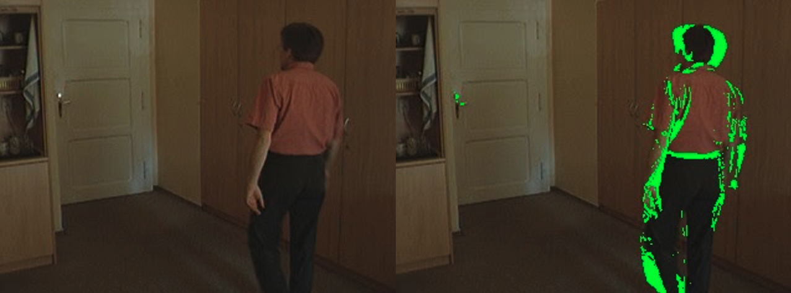
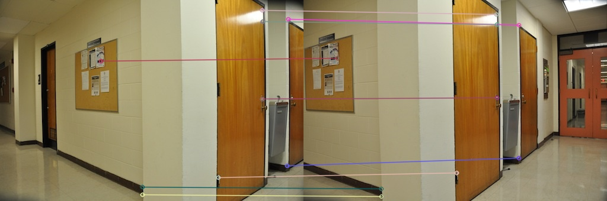
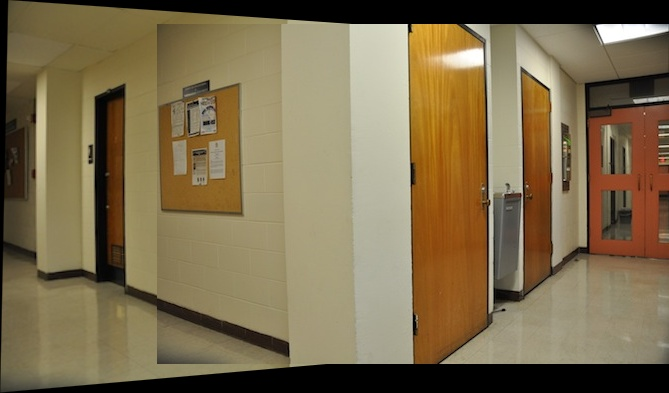
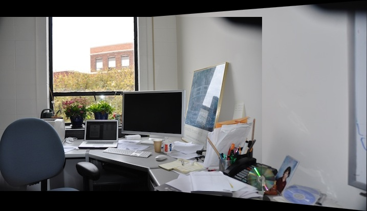
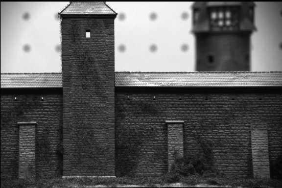
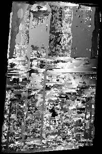
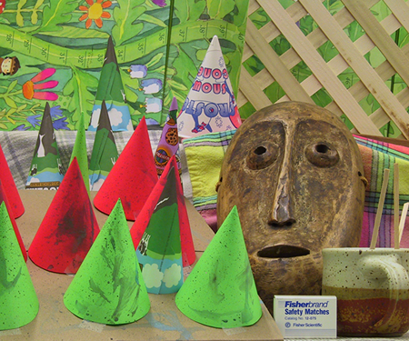
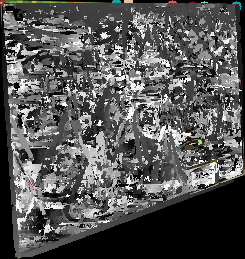

<h2>About</h2>
    

        The following projects were part of EECE 5639 Fall 2021 with professor 
        <a href="https://coe.northeastern.edu/people/camps-octavia/"> Dr. Octavia Camps.</a> The experiments were programmed in 
        Python3, and some methods utilized functions from the open source computer vision library
        <a href="https://docs.opencv.org/4.x/"> OpenCV2</a>. The following topics are explored:
        <ul>
            <li>Box and Gaussian Smoothing Filters</li>
            <li>Motion detection</li>
            <li>Edge and Corner Detection</li>
            <li>Normalized Cross Correlation</li>
            <li>RANSAC Homography Estimation</li>
            <li>Image Mosaicing</li>
            <li>Stereo Vision</li>
        </ul>
    

    <h2>Project 1 - Motion Detection </h2>
    

        This project implemented motion detection in image sequences captured with a stationary 
        camera. Most of the pixels in each frame belong to a stationary background, and 
        a relatively small moving objects pass in front of the camera. The two image sequences 
        both involved a person walking through a room. Motion is detected by looking 
        at large temporal gradients of each pixel value.
    

    
    
<i>Motion Detection from Image set 1</i>

    

        Two techniques were applied in order to impropve the acuracy of the object detection. Firstly,
        the images were pre-processed before applying the temoporal filter by converting to grayscale
        and smoothing via spatial gaussian filtration. Secondly, the value of the temporal gradient 
        threshold to determine movement was tuned relative to the noise. 
    

    <h2>Project 2 - Image Mosaicing</h2>
    

        Image mosaicing takes two images of the same scene with slightly different points
        of view and combines them into one large image. The best example of this is using
        a panoramic feature on a smartphone. Two sets of images were used to perform mosaicing,
        and each set had 2 images. Since the two images had different coordinate systems, a 
        <a href="https://docs.opencv.org/4.x/d9/dab/tutorial_homography.html"> homography matrix </a> needed to be estimated to properly warp one 
        image before it was combined with the other.
        

    

        First, a Harris corner detector was used with non-max suppression to find a sparse set of corner 
        features in each image. Then, these features were matched using thresholded Normalized Cross Correlation.
        This process is pictured below. 
    

    

        
        
    

    
<i>Harris corner detection from hallway image set</i>

    

        Next, normalized cross correlation (NCC) was used to find a sparce set of correspondences. 
        When tuning the window size for the corner detector and  NCC, a 7 pixel diameter window centered at the corner feaure 
        was found to work best. The matches were visualized using cv2.drawMatches().
    

    
    

        
<i>Matching corner features</i>

    

    

        Finally, a series of OpenCV functions such as cv2.findHomography(), cv2.perspectiveTransform() and 
        cv2.warpPerspective() were used create a hompgraphy with the correspondences using RANSAC, warp one of 
        the images based on the homgraphy, and then merge the warped image into the other image to create a mosaic. 
        The results can be seen below.
    

    
    

        
<i>Mosaiced images from set 1</i>

    

    
    

        
<i>Mosaiced images from set 2</i>

    

    

    <h3>Project 3</h3>
    

        A single 2D image lacks the ability to convey depth - something humans are able to do well using our
        natural stero vision. Stero camera sytems view the same scene from slightly different angles using two cameras,
        and the disparities between features allow for depth estimation and the reconstruction of the 3D environment. 
        Using feature correspondences and the stero system measurements such as camera distance and focal length,
        and <a href="https://en.wikipedia.org/wiki/Fundamental_matrix_(computer_vision)">fundamental matrix </a> can be estimated which is used to rectify the images and 
        assign a relative depth to each feature point. Pictured below is one of the original stereo images from 
        each set and its corresponding depth map.
    

    

        
        
    

    

        
<i>Image from set 1 with its depth reconstruction using a stero pair</i>

    

    

        
        
    

    

        
<i>Image from set 2 with its depth reconstruction using a stero pair</i>

    
